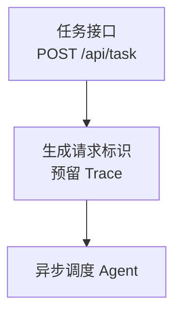

# `project-career-kit` V2 设计规格

## 目标

改进打包后的 `project-career-kit` 技能（Skill），使今后生成的中文 Markdown 求职材料
使用中文文件名，把有意义的项目链路直接放进渲染后的 Mermaid 图中，并且从项目
开发视角描述学习型或实验型项目，而不是用读者总结仓库文档的方式来描述。

## 范围

生成目录仍然是 `career-kit/`。该目录今后只生成以下 Markdown 文件：

```text
career-kit/
|- 简历素材.md
|- 面试逐字稿.md
|- 项目流程图.md
`- 证据索引.md
```

该技能不会重命名、删除或编辑早期版本生成的英文文件名产物。使用早期版本
技能生成过材料的用户可以保留这些文件；新一轮运行只写入契约规定的中文文件。

## 输出契约变更

### 中文文件名

`SKILL.md` 和 `references/output-contract.md` 将把所有生成目标替换为上面的四个
中文文件名。证据索引仍然是唯一的持久证据源；这里只改变文件名。

### Mermaid 作为主要流程说明

`项目流程图.md` 必须至少包含一个带围栏的 `mermaid` `flowchart` 代码块，其中的
节点和边直接描述已经验证的最小项目链路。重要的路由、状态转换、调用顺序或
数据传递必须由图本身表达。不能先把图缩减成通用的 A/B/C 占位节点，再把真实
流程放进可见的文字列表中。

节点标签使用简洁、易读的中文；必要时可以用 `<br/>` 添加一条简短的次要信息。
Mermaid 内部标识符保持描述性，但不能直接作为面向用户的图标签显示。只有在
所用 Mermaid 语法能够安全承载，并且引用的证据直接支持时，才把函数名、参数、
状态和字面值放入图中。

每个实质性节点声明和有意义的边，都必须紧邻放置一条格式为
`%% evidence:C001,C002` 的 Mermaid 注释，并且注释放在对应声明或边的前面。
Mermaid 渲染器会忽略这些注释，因此既能保持图面简洁，又能在源文本中保留
节点/边到证据的映射。文档不得添加可见的长篇 A/B/C 节点或边图例来重复流程。
只有在说明有证据支持的运行时未知项或渲染器兼容性限制时，才允许保留一条简短
的可见边界说明。

示例结构：



生成的文件仍然要求使用支持 Mermaid 的 Markdown 预览器查看。V2 契约明确不增加
SVG 或 PNG 渲染、外部渲染器，也不增加第五个输出文件。

### 用户可见文本与证据映射

简历素材、面试逐字稿和流程图中的普通文本只保留面向读者的 Markdown，不附带
`<!-- evidence:C... -->` 这类 HTML 证据标记。每个包含项目事实的完整段落或列表项
改由 `证据索引.md` 的“下游材料映射”表关联到证据 ID；映射表使用产物、验收单位和
证据 ID 三列，不复制到三份用户材料。Mermaid 图内的 `%% evidence:C...` 注释仍保留，
因为渲染器会忽略它，而它需要精确关联每个节点和边。

### 项目开发视角的表述

仓库文档只有在与源码或配置完成必要的交叉验证后，才能用于确定项目定位。在
`简历素材.md` 和 `面试逐字稿.md` 中，应直接用项目语言表达这种定位，而不是
写成介绍文档内容的叙述。例如，经过验证的学习型定位应写成“这是一个用于多智能体
协作技术实践的项目”，而不是“README 将其描述为学习用的多智能体协作系统”。

这是一条措辞规则，不代表可以编造作者归属。没有 E3 用户确认时，该技能仍然只
使用“项目”和“代码”作为主语，不得声称“我设计”或“我实现”。在来源出处很重要
的地方，`证据索引.md` 仍然将 README 标记为 E2 来源。

## 实施边界

- 只更新可分发技能的指令和输出契约，以及仅供开发使用的规格和测试。
- 保留证据等级、段落级覆盖、运行时未知项和当前项目清单脚本行为；将用户可见 HTML
  证据标记替换为仅位于 `证据索引.md` 的下游材料映射。
- 不修改 `agents/openai.yaml`，因为它的展示元数据不会暴露生成文件名或材料措辞。
- 改进技能包时，不修改已经生成给用户的材料。

## 验证

新增一个聚焦输出契约的回归测试，确保旧版本的英文文件名、通用流程图加可见长
图例的指导方式，以及“README 这样描述……”式措辞都会被测试识别为不合格。技能
更新后，除了确认该测试通过，还要运行完整的项目清单测试套件和技能校验器。

针对一个小型、已验证的后端测试样例运行一次全新的前向场景。确认输出恰好使用
四个中文文件名，包含带项目专属节点标签和 `%% evidence:` 注释的 Mermaid 流程图，
没有 HTML 证据标记或可见的长篇节点/边图例；任何已经验证的学习目的都要表述为项目用途，不得
使用第一人称声称个人归属。
