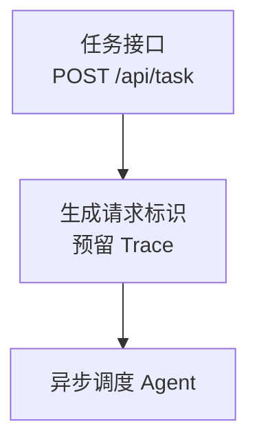

# Project Career Kit V2 Design

## Goal

Improve the packaged `project-career-kit` Skill so future Chinese Markdown
career materials use Chinese filenames, put the meaningful project path inside
the rendered Mermaid diagram, and describe learning or experimental projects
from the project's development perspective rather than as a reader's summary
of repository documentation.

## Scope

The generated directory remains `career-kit/`. Its only generated Markdown
files become:

```text
career-kit/
|- 简历素材.md
|- 面试逐字稿.md
|- 项目流程图.md
`- 证据索引.md
```

The Skill will not rename, delete, or edit earlier English-named output files.
Those files may be preserved by users who generated them with an earlier Skill
version. A new run writes only the Chinese-named contract outputs.

## Output Contract Changes

### Chinese filenames

`SKILL.md` and `references/output-contract.md` will replace every generated
output target with the four Chinese filenames above. The evidence index remains
the sole durable evidence source; only its filename changes.

### Mermaid as the primary flow explanation

`项目流程图.md` must include at least one fenced `mermaid` `flowchart` whose
nodes and edges directly describe the minimum verified project chain. The
diagram must carry the important route, state transition, call order, or data
transfer itself. It must not reduce the graph to generic A/B/C placeholders and
then place the real flow in visible prose bullets.

Labels use concise human-readable Chinese and may use `<br/>` for one short
secondary detail. Internal Mermaid identifiers stay descriptive but do not
appear as the user-facing graph labels. Function names, parameters, statuses,
and literals are included only when the available Mermaid syntax is safe and
the cited evidence directly supports them.

Each substantive node declaration and meaningful edge is immediately preceded
by a Mermaid comment in the form `%% evidence:C001,C002`. Mermaid renderers
ignore these comments, preserving a clean visible graph while retaining the
node/edge-to-evidence mapping in source. The document must not add a visible
long-form A/B/C node or edge legend that duplicates the flow. A short visible
boundary note is allowed only when it states an evidence-supported runtime
unknown or a renderer compatibility limit.

Example shape:



The generated file still requires a Markdown preview that supports Mermaid.
The V2 contract deliberately does not add SVG or PNG rendering, an external
renderer, or a fifth output file.

### Project-developer framing

Repository documentation can establish project positioning only after required
cross-validation with source or configuration. In `简历素材.md` and
`面试逐字稿.md`, write that positioning as direct project language rather than
as documentary narration. For example, a verified learning positioning becomes
"这是一个用于多智能体协作技术实践的项目", not "README 将其描述为学习用的
多智能体协作系统".

This is a wording rule, not authorization to invent authorship. Without an E3
user confirmation, the Skill still uses "项目" and "代码" as the subject and
does not claim "我设计" or "我实现". `证据索引.md` continues to identify README
as an E2 source where source provenance is material.

## Implementation Boundaries

- Update only the distributable Skill instructions and contract, plus
  development-only specifications and tests.
- Preserve evidence grades, paragraph-level coverage, hidden references,
  runtime unknowns, and the current inventory script behavior.
- Do not change `agents/openai.yaml` because its display metadata does not
  expose generated filenames or material wording.
- Do not modify generated user artifacts while improving the Skill package.

## Validation

Add a focused contract regression test that fails on the pre-change English
filenames, generic-flow-plus-visible-legend guidance, and README-narration
wording. After updating the Skill, verify the test passes along with the full
inventory suite and the Skill validator.

Run a fresh forward scenario against a small verified backend fixture. Confirm
that the output uses exactly the four Chinese filenames, contains a Mermaid
flow with project-specific node labels and `%% evidence:` comments, lacks a
visible long-form node/edge legend, and phrases any verified learning purpose
as a project purpose without first-person ownership.
